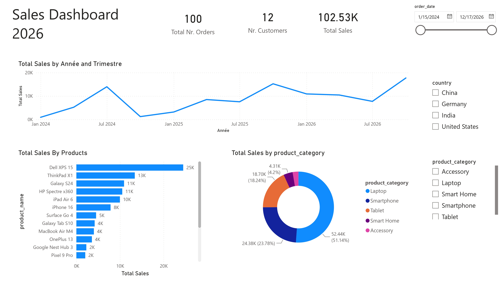

#  Bonjour, moi c'est Erwin DIDE !

### 🚀 Data Engineer | Étudiant en Master d'Ingénierie (Data)

Bienvenue sur mon profil GitHub ! Passionné par la Data Engineering, l'orchestration de pipelines complexes et le MLOps, j'aime concevoir des architectures de données modulaires, scalables et orientées business.

---

## 🛠️ Stack Technique & Compétences

| Domaine | Technologies & Outils |
| :--- | :--- |
| **Bases de données** | PostgreSQL, MySQL, DuckDB, MongoDB, Oracle |
| **Orchestration & ETL/ELT** | Airflow, Dagster, dbt, Talend |
| **Cloud & Storage** | GCP (BigQuery, Vertex AI), Distributed Systems (Hadoop, Kafka) |
| **MLOps & CI/CD** | MLflow, W&B, Docker, Kubernetes, GitHub Actions, GitLab CI, DVC |
| **Langages** | Python, SQL, Java, C |
| **Data Viz & BI** | Tableau, Power BI, Metabase, Streamlit |

---

## 📌 Projets à la une

### 📊 1. [Dashboards & Analytics (Ventes & CRM)](https://github.com/ErwinDIDE)
> **Stack :** `Tableau` 
*   Conception de tableaux de bord interactifs pour l'analyse de performances multi-annuelles et l'aide à la décision business.
*   *Découvrez mon dashboard interactif en ligne sur [Mon profil Tableau Public](https://public.tableau.com/app/profile/erwin.dide/vizzes)

  
  <section id="tableau-dashboard" style="margin: 40px 0;">
    <h2>📊 Tableau de bord interactif – Analyse des Ventes Multi-Années</h2>
    
Explorez les KPIs, filtrez par région ou catégorie de produits directement ci-dessous :

  
    

      <iframe 
        src="https://public.tableau.com/views/Projet_Dashboard_Ventes_Multi_Annees/SalesDashboard?:showVizHome=no&:embed=true" 
        width="100%" 
        height="100%" 
        style="border: none;">
      </iframe>
    

  
    

      <i>Problème d'affichage ? <a href="https://public.tableau.com/views/Projet_Dashboard_Ventes_Multi_Annees/SalesDashboard" target="_blank">Ouvrir directement sur Tableau Public ↗</a></i>
    

  </section>

### 📊 2. [Dashboards & Analytics - Power BI](https://github.com/ErwinDIDE)
> **Stack :** `Power BI` • `DAX` • `Modélisation de Données`
* Modélisation de données analytiques, création de mesures DAX et conception de rapports visuels interactifs.
* Analyse des ventes, suivi du volume de commandes et segmentation des clients.

<section id="powerbi-dashboard" style="margin: 40px 0;">
  <h2>📊 Tableau de bord – Sales Dashboard 2026 (Power BI)</h2>
  
Aperçu visuel de l'analyse globale des ventes et des performances produits :

  

    
  

  

    <i>🛠️ Modélisation en étoile & mesures DAX développées sous Power BI Desktop</i>
  

</section>

### 🚕 3. [Pipeline de Données Scalable (Taxi & Météo)](https://github.com/ErwinDIDE)
> **Stack :** `Spark` • `Flink` • `dbt` • `Airflow` • `Docker`
*   Conception d'une architecture modulaire capable d'ingérer, stocker et transformer des données de trajets de taxis en temps réel croisées avec des conditions météo.
*   Modélisation de données analytiques et orchestration bout en bout du pipeline.

### 💳 4. [Plateforme MLOps - Détection de Fraude Bancaire](https://github.com/ErwinDIDE)
> **Stack :** `Python` • `FastAPI` • `MLflow` • `W&B` • `XGBoost`
*   Entraînement et optimisation d'un modèle de classification XGBoost sur des données Kaggle pour maximiser le rappel et la précision.
*   Mise en place d'une API de prédiction performante via **FastAPI**.
*   Tracking des expériences, versioning des modèles et suivi des métriques en temps réel sur **MLflow** & **W&B**.

---

## 🎓 Formation

*   **Master d'Ingénierie — Spécialisation Data** | *SUPINFO* (2025 - 2027)
    *   *Data Viz, Machine Learning (Vision, Classification, Réseaux de neurones), Admin DB & Systèmes Distribués.*

---

## 📬 Me contacter

*   **📍 Localisation :** Rouen, France
*   **📧 Email :** [didymedide0808@gmail.com](mailto:didymedide0808@gmail.com)
*   **💼 LinkedIn :** [Linkedin - Erwin DIDE](https://linkedin.com/in/erwin-dide) 
*   **📊 Tableau Public :** [Profil Tableau Public](https://public.tableau.com/app/profile/erwin.dide/vizzes)
